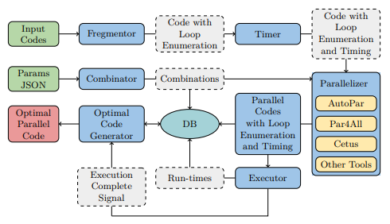
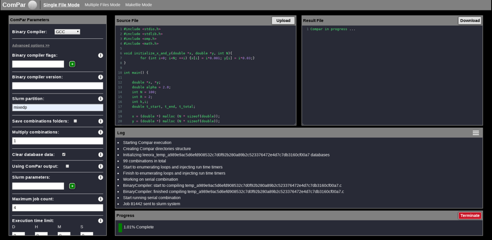
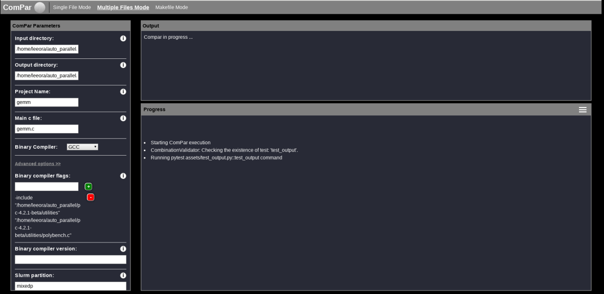
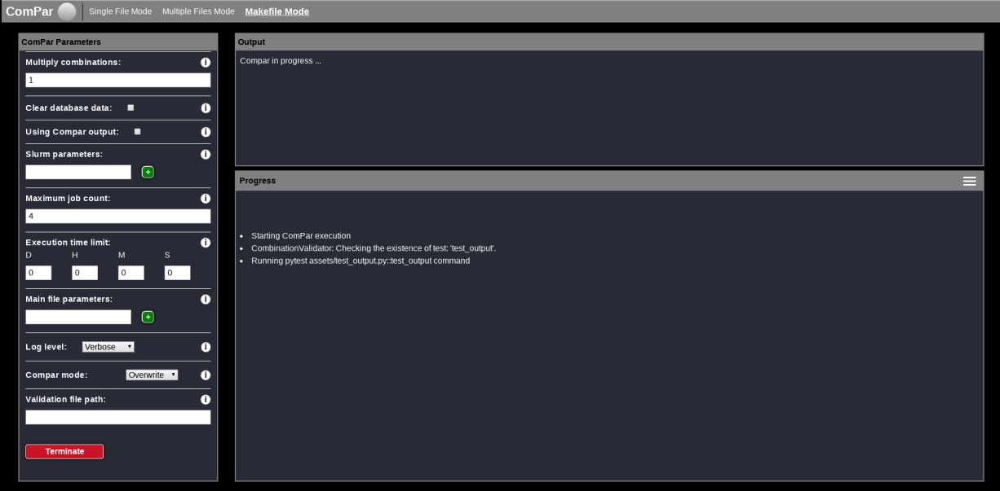

# ComPar: Optimized Multi-Compiler for Automatic OpenMP S2S Parallelization

ComPar is a source-to-source compiler that optimizes the parallelizaton of a code (in terms of performances), that can be achieved from automatic parallelization compilers without any human intervention. This is done by fusing other source-to-source compilers' outputs. The only human intervention in ComPar is by supporting the source code to be parallelized and setting the desired hyperparameters (i.e. the parameters defined by the different compilers and OpenMP) in a JSON format. Afterwards, ComPar divides the source code into loop segments, and from the provided JSON file it creates different combinations of these parameters. The combinations are assembled with the code segments and each segment is run by all of the compilers. Finally, ComPar chooses the best combination for the given code, i.e. the combination with the shortest execution time, while removing unnecessary parallelization pragmas.

**Note:** The correctness of the input parameters affects the correctness of the parallelized code. It is the responsibility of the user to provide the right parameters as the user is familiar with the input code's logic and its dependencies. We suggest two methods to overcome this problem:
* ComPar's black-box testing functionality, which examines the functionality of an application before and after the parallelization without peering into its internal structures or workings.
* AutoPar's ability to ensure the correctness of pragmas in a given parallel code. 

## ComPar Architecture



## Getting Started

### Prerequisites

First, clone the ComPar code provided here.
```
clone https://github.com/Mosseridan/compar.git
```
Then, you should install and load the supported compilers (i.e. Cetus, Par4All and AutoPar) to your environment. For further information, please see [Cetus](https://engineering.purdue.edu/Cetus/) and [AutoPar](https://en.wikibooks.org/wiki/ROSE_Compiler_Framework/autoPar).
You will also need to install SLURM as well as MongoDB before running ComPar. Moreover, you should have clang-format version > 5.
In addition, you should downlowd Python3 with the following packages:
* wtforms
* flask >= 1.1
* flask-wtf
* python-dotenv
* flask-bootstrap
* pymongo
* pytest
* jsonschema
In order to install these packages, you can simply run the following commands in your conda environment:
```
pip install wtforms
pip install flask
pip install flask-wtf
pip install python-doten
pip install flask-bootstrap
pip install pymongo
pip install pytest
pip install jsonschema
```

### Know Your Flags

**Required Flags:**
* -wd (or --working_directory): Specify the working directory path to your code.
* -dir (or --input_dir): Specify the path to the directory of your input files.
* -main_file_r_p (or --main_file_rel_path): Relative path to the main C file.
  * Default = "".

**Optional Flags:**
* -comp (or --binary_compiler_type): Specify the binary compiler type.
  * Default = "".
* -comp_v (or --binary_compiler_version): Specify the vesion of the binary compiler.
  * Default = None.
* -comp_f (or --binary_compiler_flags): Specify the binary compiler flags.
  * Default = None.
* -save_folders (or --delete_combinations_folders): Save all combinations folders (binary flag).
  * If the user does not use this flag, then the combinations folders will be saved. Otherwise, the combinations will not be saved.
* -make (or --is_make_file): Use makefile (binary flag).
  * If the user uses this flag, the code will run the provided makefile.
* -make_c (or --makefile_commands): List of makefile commands.
  * Default = None.
* -make_op (or --makefile_exe_folder_rel_path): Makefile output executable folder relative path to input directory.
  * Default = "".
* -make_on (or --makefile_output_exe_file_name): Set the name of the executable file generated by the makefile.
  * Default = "".
* -ignore (or --ignored_rel_path): List of relative folder paths to be ignored while parallelizing.
  * Default = None.
* -include (or --include_dirs_list): List of relative paths to be included in compilation.
  * Default = None.
* -main_file_p (or --main_file_parameters): List of main C file parameters.
  * Default = None.
* -slurm_p (or --slurm_parameters): List of SLURM parameters.
  * Default = None.
* -t (or --time_limit): Time limit for runtime execution.
  * Default = None.
* -extra (or --extra_files): List of relative extra files to parallelize in addition to current ones.
  * Default = None.
* -partition (or --slurm_partition): Slurm partition name.
  * Default = grid.
* -v (or --verbose): Get more verbose output.
  * Default = logger.BASIC.
* -vv (or --debug): Get debug output.
  * Default = logger.BASIC.
* -test_file (or --test_file_path): Unit test file path.
  * Default = "".
* -jobs_quantity (or --jobs_quantity_at_once): The number of jobs to be executed at once.
  * Default = num_of_jobs_at_once.
* -mode (or --mode): ComPar working mode.
  * Default = ComParConfig.DEFAULT_MODE.
* -with_markers (or --code_with_markers): Mark that the code was parallelized with ComPar before (i.e. the source code was already parallelized by ComPar). 
  * By using this flag, a user can run only runtime libraries and omp directives.
* -clear_db (or --clear_db): Delete the results from database.
    
### Compliation Parameters

The compilation parameters are divided into 2 main groups: essential and optional.
The essential parameters are the ones to appear in all combinations, while the optional parameter might be excluded from one or more combinations (depends on ComPar choice).
You can see an example for such a file in *compilation_params.json* under *assets* directory.

| Compiler  | Flags |
| ------------- | ------------- |
| Cetus (essential)  |  None |
| Cetus (optional)  | <ul><li>**-parallelize-loops:** annotate loops with parallelization decisions, such as which level of loops will be parallelized</li><li>**-reduction:** perform reduction variable analysis</li><li>**-privatize:** perform scalar/array privatization analysis</li><li>**-alias:** specify level of alias analysis</li></ul>|
| AutoPar (essential)  | <ul><li>**--keep_going:** auto parallelization will keep going even if errors occur</li></ul>|
| AutoPar (optional)  | <ul><li>**--enable_modeling:** enabling cost modeling of loops to guide parallelization</li><li>**--no_aliasing:** assume no pointer aliasing exists</li><li>**--unique_indirect_index:** assuming all arrays used as indirect indices have unique elements (no overlapping)</li></ul>|
| Par4All (essential)  | <ul><li>**-O:** parallelize with OpenMP output </li></ul>|
| Par4All (optional)  | <ul><li>**--fine-grain:** use a fine-grain parallelization algorithm instead of a coarse-grain parallelization.</li><li>**--com-optimization:** enable memory transfert optimizations (one should not use this flag on a code with pointer aliasing).</li><li>**--no-pointer-aliasing:** assume there is no pointer aliasing.</li></ul>|


### OpenMP Directives
The fashion of OMP's directives should be specified in *assets/omp_directives_params.json*

| Directive  | Supported Options |
| ------------- | ------------- |
| schedule  | <ul> <li>static ([2, 4, 8, 16, 32])</li> <li>dynamic</li> </ul> |


### OpenMP Runtime Libraries Routines (RTL)
The parameters of the OpenMP environment, e.g. the number of threads to be used. One should specify th desired RTLs of ComPar in *assets/omp_rtl_params.json*.
The table below presented currently supported OpenMP runtime libraries routines.

| RTL  | Supported Options |
| ------------- | ------------- |
| omp_set_num_threads  | [INTEGER] |


### Run
ComPar has 3 modes:
* **new**: One can specify its working direstory using `-wd` flag. Running on *new* mode, ComPar creates this folder if it does not exist. In case that the specified directory is already exists, ComPar will create a new directory with the same name followed by an integer. For example if the directory *home/gemm* specified by the `wd` flag is already exists, ComPar will create *home/gemm1* directory instead. Thus, the files in *home/gemm* will not be overriden. You can see the name if the new directory at the command line or at the log file.
* **override**: If the directory that was specified by the `wd` flag is already exists, ComPar will override its files.
* **continue**: Run only the combinations that are not in the combinations folder of the directory specified by the `wd` flag.

You should run *program.py* using Python3 with the relevant flags (as described in [here](https://github.com/Mosseridan/compar/blob/master/README.md#know-your-flags)).

In addition, one can write a path to scripts to each source-to-source compiler in *assets/pre_processing.json* and *assets/post_processing.json* to be run prior to processing and after processing respectively. Consider, for eaxmple, the following pre_procsseing file: 
```
{
  "autopar": "/home/autopar_pre_processing_script.sh",
  "par4all": "/home/p4a__pre_processing_script.sh",
  "cetus": ""
}
```
As one can see, both AutoPar and Par4All have scripts to be run before the processing in */home/autopar_pre_processing_script.sh* and in */home/p4a_pre_processing_script.sh* directories respectivley. Nonetheless, Cetus has no such script. Therefore, Cetus's field in this JSON file remains empty.
The script of AutoPar, for eaxmple, is as follows:
```
make veryclean
make $bencmark_name CLASS=C
mv bin/$bencmark_name_lower.C.x bin/compiled_files
```

#### Example (Running via cmd)

In the following example, the code to be parallelized is in *path_to_source_forlder*. The user wants to use the makefile in this folder and specifies makefile comands (*-make_c "make clean" "make"*). Moreover, the user specifies the makefile output executable folder relative path to input directory (*-make_op "."*) and sets the name of the executable file generated by the makefile to be gemm (*-make_on gemm*). In addition, using the *-include* flag, the user provides the path to the directory that contains the files to be used in the makefile. As one can see, the user does not want to save the combinations folders (*-save_folders*). Furthermore, the user provides the relative path to the main C file (*-main_file_r_p source_file_containing_main*).

```
python program.py -dir path_to_source_forlder -wd path_to_output_folder -make -make_c "make clean" "make" -make_op "." -make_on gemm -include includes_used_in_makefile -save_folders -main_file_r_p source_file_containing_main
```


## ComPar's GUI
The ComPar graphical user interface is a single window which is composed of three modes: single file mode, multiple files mode and makefile mode. The single file mode can be used when there is only one input file, the multiple files mode can be used to parallelize a project containing multiple files that dose not have a makefile and the makefile mode is used to parallelize a project that has a makefile.
If the user works in a single file mode without makefile and he does not choose a preferable machine-code compiler, ComPar will choose the most suited compiler for the input code according to the system hardware. For example, for AMD hardware, ComPar will compile the code using GCC. We intend to examine this feature over other ComPar's modes.

### Single File Mode Segments
* *Source File* : upload, write and edit the source file.
* *Result File* : this area displays the output file generated by ComPar, as well as ComPar's progress.
* *Log* : in this area one can observe the logs from the system.
* *ComPar's Paramneters* : view and edit the different parameters as will be explained below: 
  * In this mode you can choose your preferable binary compiler. Currently, ComPar supports both gcc and icc.
 For additional options, please click on `Advanced options >>`. After clicking on it, you will see the following options:
  * `Binary compiler flags`: Specify desired flags of the compiler (press the `+` button after every single flag).
  * `Binary compiler version`: Specify your compiler's version.
  * `Slurm partition`: Specify your SLURM partition (the default partition is `grid`).
  * `Save combination folders`: Check this field if you wish to save the combination folder.
  * `Clear database data`: Check this field if you want to clear the database.
  * `Using ComPar output`: Check this field if your source code is an output of ComPar.
  * `Slurm parameters`: Specify your SLURM parameters (press the `+` button after each and every parameter).
  * `Maximum job count`: Specify the maximum number of jobs running simultaneously (the default is 4).
  * `Execution time limit`: Specify the time limit for each combination.
  * `Main file parameters`: Specify the parameters to the main file (if there are any).
  * `Log level`: Choose your desired log level (basic/verbose/debug).
  * `ComPar mode`: Select your mode of ComPar (override/new/contine). For more information, please see [here](https://github.com/Mosseridan/compar/blob/master/README.md#run).
  * `Validation file path`: Specify the absolute path to python file named *test_output.py* with test function *test_output*. This file will validate the output of every combination.

At the end, press the `START` button. At any time, one can cancel ComPar's execution by pressing the `Terminate` button.



### Multiple Files Mode Segments
* *Output*: displays ComPar's progress.
* *Log*: in this area one can observe the logs from the system.
* At the *ComPar Parameters* window, you can specify the following parameters:
  * `Input directory`: Specify the absolute path to the input directory.
  * `Output directory`: Specify the absolute path to the output directory.
  * `Main C file`: Specify the relative path to the main C file (relative to input directory).
  * `Binary compiler`: You can choose between the currently supported binary compilers (gcc/icc).
After cliking on `Advanced options >>` the following parameters will be editable:
  * `Binary compiler flags`: Specify desired flags of the compiler (press the `+` button after every single flag).
  * `Binary compiler version`: Specify your compiler's version.
  * `Slurm partition`: Specify your SLURM partition (the default partition is `grid`).
  * `Save combination folders`: Check this field if you wish to save the combination folder.
  * `Clear database data`: Check this field if you want to clear the database.
  * `Using ComPar output`: Check this field if your source code is an output of ComPar.
  * `Slurm parameters`: Specify your SLURM parameters (press the `+` button after each and every parameter).
  * `Maximum job count`: Specify the maximum number of jobs running simultaneously (the default is 4).
  * `Execution time limit`: Specify the time limit for each combination.
  * `Main file parameters`: Specify the parameters to the main file (if there are any).
  * `Log level`: choose your desired log level (basic/verbose/debug).
  * `ComPar mode`: Select your mode of ComPar (override/new/contine). For more information, please click [here](https://github.com/Mosseridan/compar/blob/master/README.md#run).
  * `Validation file path`: Specify the absolute path to python file named *test_output.py* with test function *test_output*. This file will validate the output of every combination.

At the end, press the `START` button. At any time, one can cancel ComPar's execution by pressing the `Terminate` button.



### Make File Mode Segments
* *Output*: displays ComPar's progress.
* *Log*: in this area one can observe the logs from the system.
* *ComPar's Paramneters*: view and edit the following parameters:
  * `Input directory`: Specify the absolute path to the input directory.
  * `Output directory`: Specify the absolute path to the output directory.
  * `Main C file`: Specify the relative path to the main C file (relative to input directory).
  * `Makefile commands`: Add the makefile commands to be run (press the `+` button after each command).
  * `Executable folder relative path`: Specify the relative path (relative to input directory) of the directory that contains the executable file (if the executable is in the main folder, leave this field empty).
  * `Executable file name`: Specify the name of the executable file created by the makefile.

After cliking on `Advanced options >>` the following parameters will be editable:
  * `Folders to ignore`: Add relative paths (relative to input directory) to the folders that need to be included for parallelization (press the `+` button after every path).
  * `Folders to include`: Add relative paths (relative to input directory) to the folders that do not need to be parallelized (press the `+` button after every path).
  * `Extra files`: Specify extra files' relative paths (relative to input directory) that need to be added for parallelization process.
  * `Slurm partition`: Specify your SLURM partition (the default partition is `grid`).
  * `Save combination folders`: Check this field if you wish to save the combination folder.
  * `Clear database data`: Check this field if you want to clear the database.
  * `Using ComPar output`: Check this field if your source code is an output of ComPar.
  * `Slurm parameters`: Specify your SLURM parameters (press the `+` button after each and every parameter).
  * `Maximum job count`: Specify the maximum number of jobs running simultaneously (the default is 4).
  * `Execution time limit`: Specify the time limit for each combination.
  * `Main file parameters`: Specify the parameters to the main file (if there are any).
  * `Log level`: Choose your desired log level (basic/verbose/debug).
  * `ComPar mode`: Select your mode of ComPar (override/new/contine). For more information, please see [this](https://github.com/Mosseridan/compar/blob/master/README.md#run).
  * `Validation file path`: Specify the absolute path to python file named *test_output.py* with test function *test_output*. This file will validate the output of every combination.

At the end, press the `START` button. At any time, one can cancel ComPar's execution by pressing the `Terminate` button.


