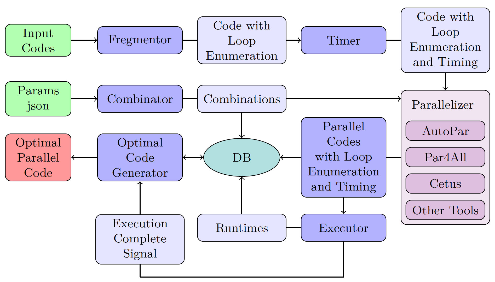

# ComPar: Optimized Compiler for Automatic OpenMP S2S Parallelization using Code Segmentation and Hyperparameters Tuning

ComPar is a source-to-source compiler that generates the best parallelized code (in terms of performances) which can be achieved from automatic parallelization compilers without any human intervention. This is done by fusing other source-to-source compilers' outputs. The only human intervention in ComPar is by supporting the source code to be parallelized and setting the desired hyperparameters (i.e. the parameters defined by the different compilers and OpenMP) in a JSON format. Afterwards, ComPar divides the source code into loop segments, and from the provided JSON file it creates different combinations of these parameters. The combinations are assembled with the code segments and each segment is run by all of the compilers. Finally, ComPar chooses the best combination for the given code, i.e. the combination with the shortest execution time, while removing unnecessary parallelization pragmas.

**Note:** The correctness of the input parameters affects the correctness of the parallelized code. It is the responsibility of the user to provide the right parameters as the user is familiar with the input code's logic and its dependencies.

## ComPar Architecture



## Getting Started

### Prerequisites

First, clone the ComPar code provided here.
Then, you should install and load the supported compilers (i.e. Cetus, Par4All and AutoPar) to your environment, as well as Python3.

### Know Your Flags

**Required Flags:**
* -wd (or --working_directory): Specify the working directory path to your code.
* -dir (or --input_dir): Specify the path to the directory of your input files.
* -main_file_r_p (or --main_file_rel_path): Relative path to the main C file.
  * Default = "".

**Optional Flags:**
* -comp (or --binary_compiler_type): Specify the binary compiler type.
  * Default = "".
* -comp_v (or --binary_compiler_version): Specify the vesion of the binary compiler.
  * Default = None.
* -comp_f (or --binary_compiler_flags): Specify the binary compiler flags.
  * Default = None.
* -save_folders (or --delete_combinations_folders): Save all combinations folders (binary flag).
  * If the user does not use this flag, then the combinations folders will be saved. Otherwise, the combinations will not be saved.
* -make (or --is_make_file): Use makefile (binary flag).
  * If the user uses this flag, the code will run the provided makefile.
* -make_c (or --makefile_commands): List of makefile commands.
  * Default = None.
* -make_op (or --makefile_exe_folder_rel_path): Makefile output executable folder relative path to input directory.
  * Default = "".
* -make_on (or --makefile_output_exe_file_name): Set the name of the executable file generated by the makefile.
  * Default = "".
* -ignore (or --ignored_rel_path): List of relative folder paths to be ignored while parallelizing.
  * Default = None.
* -p4a_f (or --par4all_flags): List of Par4all flags.
  * Default = None.
* -autopar_f (or --autopar_flags): List of Autopar flags.
  * Default = None.
* -cetus_f (or --cetus_flags): List of Cetus flags.
  * Default = None.
* -include (or --include_dirs_list): List of relative paths to be included in compilation.
  * Default = None.
* -main_file_p (or --main_file_parameters): List of main C file parameters.
  * Default = None.
* -slurm_p (or --slurm_parameters): List of SLURM parameters.
  * Default = None.
* -nas (or --is_nas): Is NAS Benchmark (binary flag).
  * If the user use this flag, the NAS Benchmark will be the input code to be parallelized.
* -t (or --time_limit): Time limit for runtime execution.
  * Default = None.
    
### Compliation Parameters

The compilation parameters are divided into 2 main groups: essential and optional.
The essential parameters are the ones to appear in all combinations, while the optional parameter might be excluded from one or more combinations (depends on ComPar choice).
You can see an example for such a file in *compilation_params.json* under *assets* directory.

| Compiler  | Flags |
| ------------- | ------------- |
| Cetus (essential)  |  None |
| Cetus (optional)  | <ul><li>**-parallelize-loops:** annotate loops with parallelization decisions, such as which level of loops will be parallelized</li><li>**-reduction:** perform reduction variable analysis</li><li>**-privatize:** perform scalar/array privatization analysis</li><li>**-alias:** specify level of alias analysis</li></ul>|
| AutoPar (essential)  | <ul><li>--keep_going</li></ul>|
| AutoPar (optional)  | <ul><li>--enable_modeling</li><li>**--no_aliasing:** assuming no pointer aliasing exists</li><li>**--unique_indirect_index:** assuming all arrays used as indirect indices have unique elements (no overlapping)</li></ul>|
| Par4All (essential)  | <ul><li>-O</li></ul>|
| Par4All (optional)  | <ul><li>--fine-grain</li><li>--com-optimization</li><li>--no-pointer-aliasing</li></ul>|

### Environment Parameters

The parameters of the OpenMP environment, e.g. the number of threads to be used.
You can see an example for such a file in *assets/env_params.json*.


### Run
You should run *program.py* using Python3 with the relevant flags (as was described in [here](https://github.com/Mosseridan/compar/blob/master/README.md#know-your-flags)).

#### Example

In the following example, the code to be parallelized is in *path_to_source_forlder*. The user wants to use the makefile in this folder and specifies makefile comands (*-make_c "make clean" "make"*). Moreover, the user specifies the makefile output executable folder relative path to input directory (*-make_op "."*) and sets the name of the executable file generated by the makefile to be gemm (*-make_on gemm*). In addition, using the *-include* flag, the user provides the path to the directory that contains the files to be used in the makefile. As one can see, the user does not want to save the combinations folders (*-save_folders*). Furthermore, the user provides the relative path to the main C file (*-main_file_r_p source_file_containing_main*).

```
python program.py -dir path_to_source_forlder -wd path_to_output_folder -make -make_c "make clean" "make" -make_op "." -make_on gemm -include includes_used_in_makefile -save_folders -main_file_r_p source_file_containing_main
```
